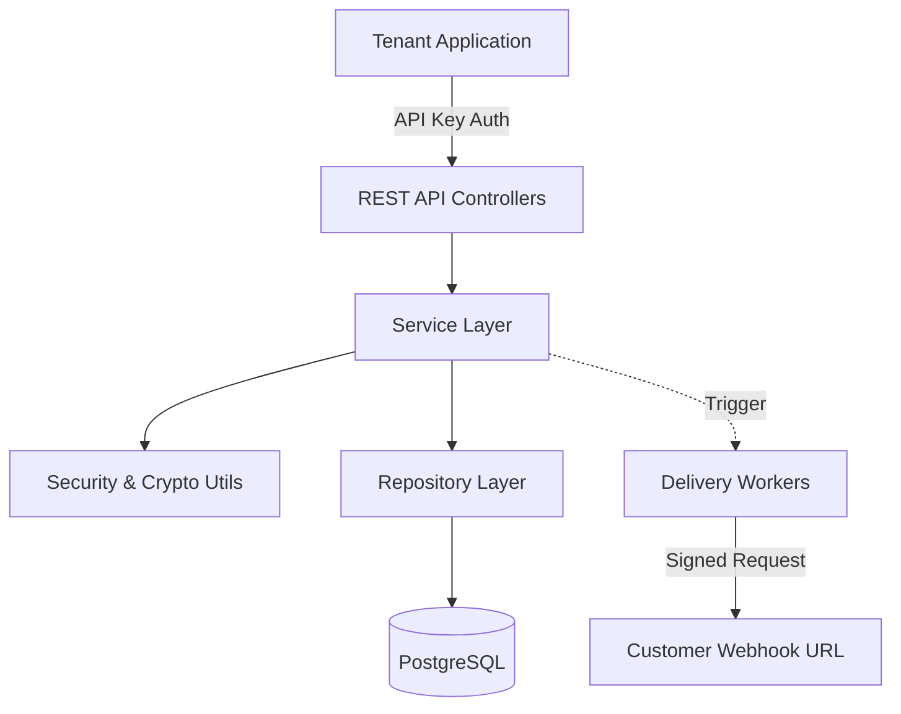
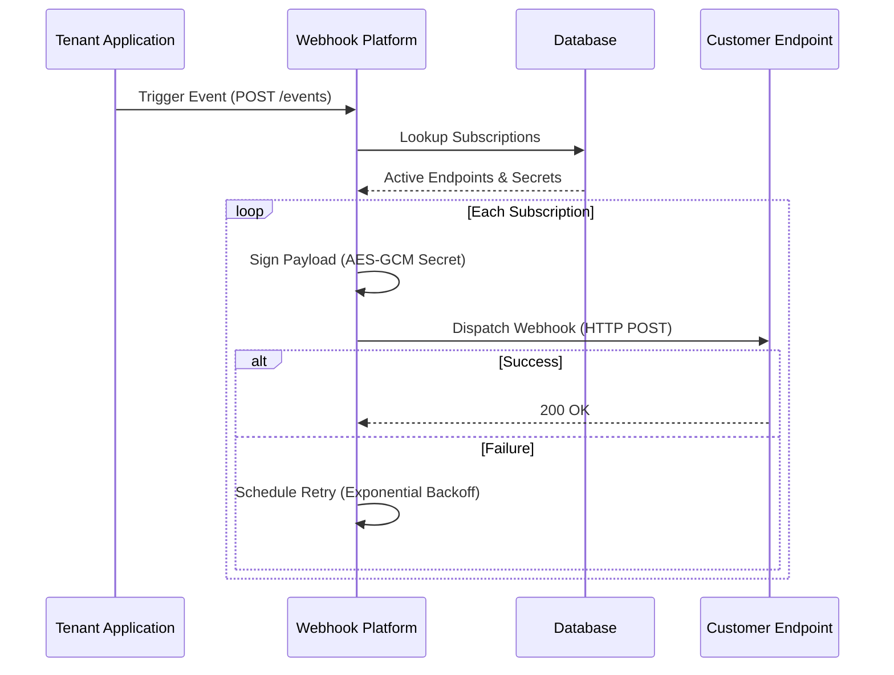

# Webhook Delivery Platform

This platform provides a centralized service for multi-tenant applications to deliver real-time event notifications to their customers. Instead of building webhook logic for every service, this platform handles the complexities of reliability, security, and tenant management in one place.

## System Architecture

The platform follows a layered architecture to ensure separation of concerns and maintainability.

## The Event Journey

When an event occurs in your application, it moves through the following stages:

## Core Capabilities

The platform is designed to manage the entire lifecycle of a webhook:

- **Multi-Tenant Isolation:** Each customer (tenant) has their own isolated workspace to manage their credentials and configurations.
- **Secure Authentication:** Tenants interact with the platform using API keys. The system stores only a hash of these keys, ensuring that even if the database is compromised, the original keys remain unknown.
- **Flexible Endpoints:** Tenants can register multiple destination URLs (endpoints) where they wish to receive data. Each endpoint can be configured with its own timeout and retry policy.
- **Event Subscriptions:** Destinations can subscribe to specific types of events. This ensures that customers only receive the data they care about, reducing unnecessary traffic.
- **Message Integrity:** Every webhook delivery is signed with a unique secret. This allows the receiver to verify that the message was sent by the platform and was not tampered with during delivery.
- **Guaranteed Delivery:** The platform manages retries with an exponential backoff strategy. If a customer's server is temporarily down, the platform will keep trying until the message is delivered or the retry limit is reached.

## The Event Journey

When an event occurs in your application, the process is straightforward:

1. **Trigger:** Your application sends an event to the platform.
2. **Match:** The platform identifies which tenants and endpoints are subscribed to that specific event type.
3. **Secure:** The platform signs the event payload using the destination's unique secret.
4. **Deliver:** The platform attempts to send the event to the configured URL.
5. **Retry:** If the delivery fails, the platform automatically schedules retries based on the endpoint's specific policy.

## Security and Privacy

Security is built into the foundation of the platform:

- **Encryption at Rest:** Sensitive data, such as webhook signing secrets, are encrypted before they are stored in the database.
- **One-Way Hashing:** API keys are never stored in plain text. Only a secure hash is kept to verify incoming requests.
- **Isolated Data:** Tenants can only see and manage their own resources, preventing any accidental data exposure between customers.

## Getting Started

To run the platform locally, you will need a relational database and a secret key used for encrypting stored secrets.

1. **Configure the Database:** Provide the connection details for your database in the application configuration.
2. **Set the Encryption Key:** Supply a master encryption key through the environment. This key is vital for recovering encrypted secrets, so it must be protected and consistent across deployments.
3. **Launch the Service:** Start the application using your preferred build tool. The service will automatically set up the necessary database tables on its first run.

The API is versioned to ensure stability as the platform evolves, with all current endpoints accessible under the primary version prefix.
