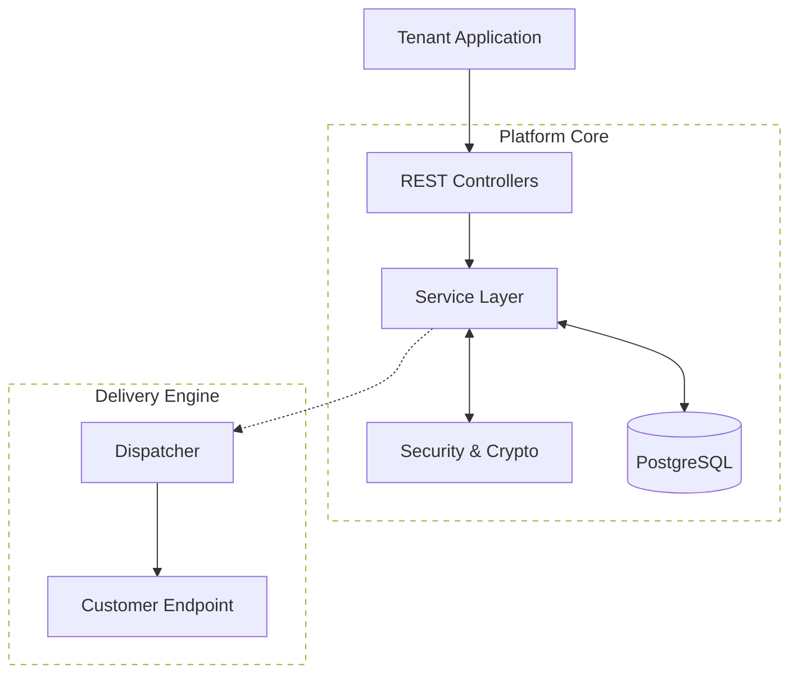
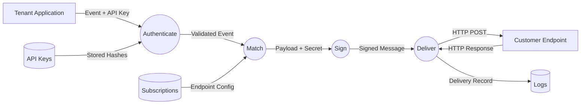

# Webhook Delivery Platform

This platform provides a centralized service for multi-tenant applications to deliver real-time event notifications to their customers. Instead of building webhook logic for every service, this platform handles the complexities of reliability, security, and tenant management in one place.

## System Architecture

The platform is organized into three primary areas: Inbound API, Core Business Logic, and the Outbound Delivery Engine.



## The Event Journey

This Data Flow Diagram (DFD) illustrates how data moves through the platform's components to ensure secure and reliable delivery.



## Core Capabilities

The platform is designed to manage the entire lifecycle of a webhook:

- **Multi-Tenant Isolation:** Each customer (tenant) has their own isolated workspace to manage their credentials and configurations.
- **Secure Authentication:** Tenants interact with the platform using API keys. The system stores only a hash of these keys, ensuring that even if the database is compromised, the original keys remain unknown.
- **Flexible Endpoints:** Tenants can register multiple destination URLs (endpoints) where they wish to receive data. Each endpoint can be configured with its own timeout and retry policy.
- **Event Subscriptions:** Destinations can subscribe to specific types of events. This ensures that customers only receive the data they care about, reducing unnecessary traffic.
- **Message Integrity:** Every webhook delivery is signed with a unique secret. This allows the receiver to verify that the message was sent by the platform and was not tampered with during delivery.
- **Guaranteed Delivery:** The platform manages retries with an exponential backoff strategy. If a customer's server is temporarily down, the platform will keep trying until the message is delivered or the retry limit is reached.

## Security and Privacy

Security is built into the foundation of the platform:

- **Encryption at Rest:** Sensitive data, such as webhook signing secrets, are encrypted before they are stored in the database.
- **One-Way Hashing:** API keys are never stored in plain text. Only a secure hash is kept to verify incoming requests.
- **Isolated Data:** Tenants can only see and manage their own resources, preventing any accidental data exposure between customers.

## Getting Started

Follow these steps to get the platform running in your local development environment.

### Prerequisites

- **Java 21** or higher
- **Maven 3.9+**
- **Docker & Docker Compose** (for the database)

### 1. Start the Database

The platform requires a PostgreSQL database. You can start one quickly using the included Docker Compose file:

```bash
docker compose up -d
```

This will start a PostgreSQL instance on `localhost:5432` with the default credentials used in the application configuration.

### 2. Configure the Environment

The platform uses a master encryption key to secure webhook secrets at rest. This key must be a **Base64-encoded 32-byte string**. You can generate one using:

```bash
# Example: Generate a random 32-byte key in Base64
openssl rand -base64 32
```

Set the key as an environment variable:

```bash
# For Unix/macOS
export WEBHOOK_ENCRYPTION_KEY=your-base64-key-here

# For Windows (PowerShell)
$env:WEBHOOK_ENCRYPTION_KEY="your-base64-key-here"
```

### 3. Run the Application

Start the Spring Boot application using Maven:

```bash
mvn spring-boot:run
```

Once the application starts, it will automatically run Flyway migrations to set up the database schema. The API will be available at `http://localhost:8080/v1`.

### 4. Running Tests

To ensure everything is set up correctly, run the test suite:

```bash
mvn test
```
